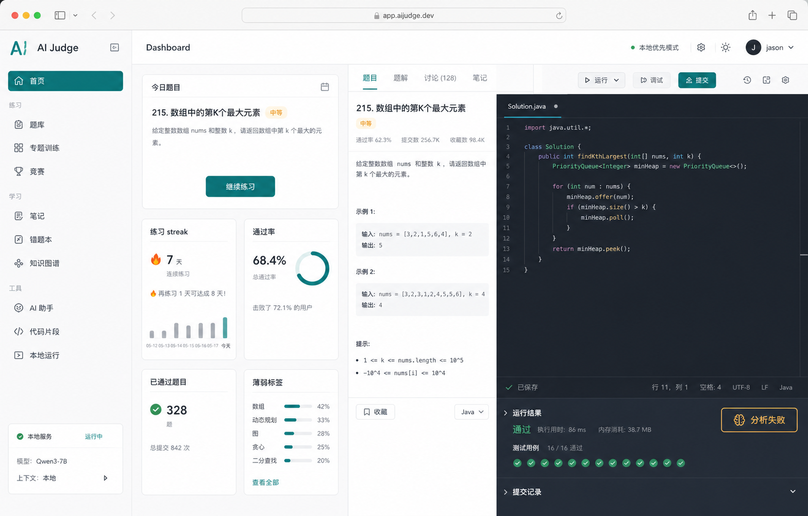

# Next Phase Directions

Last updated: 2026-05-12

This document records possible directions for the next phase of the project. It is intended as a planning reference, not a committed implementation roadmap.

## Current Positioning

The project is a local-first, pure frontend coding practice platform. The current MVP already covers the main brushing flow:

- Browse static problems.
- Open a problem workspace.
- Edit JavaScript function-style solutions in Monaco.
- Persist drafts locally through IndexedDB.
- Run visible tests and submit against all tests through QuickJS in a Web Worker.
- Store and review local submission history.
- Generate and validate static problem candidates through existing automation.

The next phase should move from "the flow works" to "the product is useful, stable, and differentiated."

## Product Direction

A strong positioning for the project is:

> A local-first, AI-assisted algorithm practice workspace.

The project should not try to compete with LeetCode by having a larger public problem bank. Its stronger differentiation can come from:

- Local-first ownership of drafts, submissions, and practice history.
- Browser-side judging for fast personal practice.
- AI-assisted failure analysis and targeted practice.
- Lightweight deployment and easy customization.
- Generated daily or weekly practice problems.

## Direction 1: Improve The Brushing Experience

This is the safest and highest-confidence direction. It improves the product even without AI.

Possible features:

- Problem filters by difficulty, tag, status, and favorite state.
- Problem status tracking: not started, attempted, accepted, recently failed.
- Better problem sorting by difficulty, title, status, or recent activity.
- Editor utilities: reset code, format code, copy code, theme switch, font size setting.
- Clearer draft feedback, including saved time and recovery state.
- Better judge result display, with failed cases surfaced first.
- Better problem workspace layout, closer to a focused IDE-style practice surface.
- Page-level tests for problem detail interactions and submission history behavior.

Good first slice:

- Add problem status derived from local submissions.
- Add difficulty and status filters to the problem list.
- Add reset and format buttons to the editor panel.

## Direction 2: Add AI Assistance Inside The Workflow

The AI assistant should be task-specific instead of a generic chat box. The best first use case is failure analysis because it has clear inputs and immediate user value.

Possible AI capabilities:

- Explain a problem in simpler language.
- Provide tiered hints without directly revealing the full solution.
- Analyze a failed submission using user code, failed cases, and judge output.
- Explain time and space complexity of the user's code.
- Review code for edge cases, readability, and likely bugs.
- Generate similar practice problems after a user solves a problem.
- Compare brute force, optimized, and ideal approaches.
- Recommend the next practice topic based on failed submissions.

Recommended first AI slice:

- Add an "Analyze Failure" action after a failed submission.
- Send the problem statement, user code, failed visible case data, and judge summary to the AI service.
- Return a short diagnosis, likely bug cause, and one or two hints.
- Avoid giving the final full solution by default.

Important architecture note:

- A pure frontend app cannot safely keep an OpenAI API key in the browser.
- For serious AI assistant features, plan a lightweight backend or user-provided local key mode.
- If keeping GitHub Pages deployment as the primary mode, AI features should be optional and clearly configured.

## Direction 3: Productize Daily And Weekly Problems

The project already has static problem generation infrastructure. The next step is to expose generated problem metadata in the frontend.

Possible features:

- Home dashboard with today's problem.
- Weekly featured topic such as arrays, stacks, binary search, or dynamic programming.
- Generated problem metadata: featured type, generated time, topic, and source.
- Completion status for daily and weekly problems.
- Practice streaks and weekly summaries.
- Separate views for base problems and generated featured problems.

Good first slice:

- Extend generated problem metadata.
- Surface daily or weekly featured problems in the problem list.
- Add a lightweight dashboard entry point.

## Direction 4: Upgrade The Problem System

As the problem bank grows, problem quality and structure will matter more than raw quantity.

Possible features:

- Official solution notes and reference implementations.
- Complexity metadata for intended solutions.
- Topic groups such as arrays, strings, stack, hash table, binary search, and dynamic programming.
- Problem source metadata: hand-written, AI-generated, curated, or featured.
- Problem quality checks for duplicate IDs, weak tests, missing edge cases, and invalid starter code.
- Problem versioning for generated content.
- Better hidden test behavior, showing failure category without exposing all hidden data.
- Support for richer structures such as linked lists, binary trees, and graphs.

Good first slice:

- Add optional problem metadata for source, featured status, and topic.
- Update validation scripts to enforce the new metadata when present.

## Direction 5: Build A Local Data Center

Because the project is local-first, local data should become a first-class product feature.

Possible features:

- A stronger global submissions page with filters and search.
- View the code for a historical submission.
- Compare two submissions for the same problem.
- Track accepted count, attempted count, and recent activity.
- Show progress by tag and difficulty.
- Export all local data as JSON.
- Import previously exported local data.
- Add a settings page for editor, judge, persistence, and AI configuration.

Good first slice:

- Improve the submissions page with filtering by problem, status, and date.
- Add a submission detail view that shows the submitted code and judge summary.

## Direction 6: Improve Judge And Debugging Capabilities

The current QuickJS judge is enough for the MVP. The next useful improvements should target debugging clarity.

Possible features:

- Custom test case input.
- Run a single selected test case.
- Capture and display `console.log` output.
- More explicit separation of wrong answer, runtime error, timeout, and internal error.
- Stronger timeout handling.
- Better error messages when QuickJS or the Worker fails to start.
- Approximate memory usage hints if feasible.
- Async function problem support if a future problem type needs it.

Recommended first judge slice:

- Add custom visible test input.
- Capture console output during execution.
- Improve Worker startup and runtime failure messages.

## Direction 7: Improve Visual Design And Product Feel

Ant Design gives the project a solid baseline, but a stronger visual direction would make the product feel less like a scaffold.

UI concept reference:

Possible features:

- Dashboard home page instead of routing directly to the problem list.
- Navigation grouped around Practice, Featured, Submissions, Stats, and Settings.
- More compact IDE-style problem workspace.
- Result panel styled as a test report.
- Stronger accepted-state feedback after a successful submit.
- Visual labels for AI-generated and featured problems.

Good first slice:

- Add a dashboard with practice summary and featured problem entry points.
- Refine the problem workspace layout after core UX features are stable.

## Direction 8: Consider A Lightweight Backend

The current frontend-only architecture is simple and deployable through GitHub Pages. A backend should only be introduced if the product goal requires it.

Reasons to stay frontend-only:

- Very simple deployment.
- No account system.
- No server cost.
- Easier to understand and modify.
- Works well as a local learning tool.

Reasons to add a backend:

- Secure AI API calls.
- User accounts and cloud sync.
- Real hidden tests.
- Shared leaderboards or public profiles.
- Centralized problem updates.
- More realistic judging beyond browser limitations.

Recommended stance:

- Stay frontend-only for the next product polish phase.
- Design AI features so they can later move behind a backend.
- Add a backend only when AI, cloud sync, or secure judging becomes a primary goal.

## Suggested Roadmap

The most pragmatic next phase is:

1. Improve brushing experience.
2. Complete the local data loop.
3. Add one focused AI feature.
4. Productize daily or weekly generated problems.
5. Harden runtime error handling and fallback states.

Suggested concrete sequence:

1. Add status tracking and filters to the problem list.
2. Add editor utilities: reset, format, and clearer draft state.
3. Improve submissions page with filtering and submission detail.
4. Add custom test cases and console output capture.
5. Add AI failure analysis as the first assistant feature.
6. Surface featured problem metadata in the frontend.
7. Add dashboard and practice statistics.

## Planning Notes

- Avoid building a generic AI chat UI before there is a concrete workflow need.
- Avoid expanding the problem bank too quickly without validation and metadata.
- Treat local data import/export as important if this remains a local-first product.
- Keep GitHub Pages compatibility unless there is a clear reason to introduce a backend.
- Use focused Vitest coverage for service logic, judge behavior, problem validation, and data shaping.
